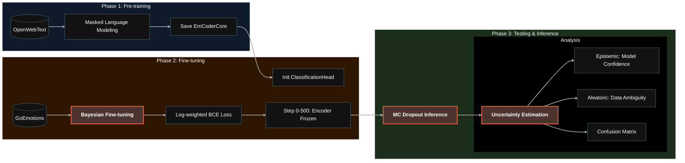

# Architecture

```mermaid
graph LR
    classDef MCD fill:#4d4000,stroke:#ffd700,stroke-width:2px,stroke-dasharray: 5 5,color:#fff;
    classDef OutNode fill:#0d47a1,stroke:#64b5f6,stroke-width:3px,color:#fff,font-weight:bold;
    classDef BayesNode fill:#4e342e,stroke:#ff7043,stroke-width:2px,stroke-dasharray: 3 3,color:#fff;
    classDef LoopNode fill:#101416,stroke:#90a4ae,stroke-width:2px,color:#eceff1,font-style:italic;

    subgraph InputGroup ["Input Operations"]
        direction TB
        ids[Batch IDs]:::DarkNode
        mask[Batch Mask]:::DarkNode
        MCD_Loop(["MC-Inference Loop: N_samples"]):::LoopNode
    end

    subgraph EmCoderCore ["EmoCoder Core (L=6)"]
        direction LR
        tok_emb["Token Embedding"]:::DarkNode
        Transformer["Transformer Encoder"]:::DarkNode
        final_norm["Final LayerNorm"]:::DarkNode
        
        ids ==> tok_emb
        tok_emb ==> ln_in["Input LayerNorm"]:::DarkNode
        
        ln_in -.-> Dropout1[("`MC-Dropout`")]:::MCD
        Dropout1 ==> Transformer
        Transformer -.-> Dropout2[("`MC-Dropout`")]:::MCD
        Dropout2 ==> final_norm
    end

    subgraph ClassifierHead ["Classification Head"]
        direction TB
        pool["Masked Mean Pooling"]:::DarkNode
        
        subgraph MLP ["Classifier MLP"]
            L_lin["Linear 1"]:::DarkNode
            Dropout3[("`MC-Dropout`")]:::MCD
            GELU[GELU]:::DarkNode
            F_lin["Final Linear"]:::DarkNode
        end
    end

    MCD_Loop -.-> ids
    final_norm ==> pool
    mask ==> pool
    pool ==> L_lin
    L_lin -.-> Dropout3
    Dropout3 ==> GELU
    GELU ==> F_lin

    F_lin ==> Out(["Class LogitsMC
    (n_samples, B, 28)"]):::OutNode
    
    Out ==> Avg["Bayesian Post-processing
    mean_probs = sigmoid.mean
    uncertainty = std"]:::BayesNode

    %% --- DARK THEME STYLING ---
    classDef DarkNode fill:#121212,stroke:#546e7a,color:#fff;
    
    style EmCoderCore fill:#1a0f2e,stroke:#9c27b0,stroke-width:2px,color:#fff
    style ClassifierHead fill:#101416,stroke:#455a64,stroke-width:2px,color:#fff
    style InputGroup fill:#0a0a0a,stroke:#424242,stroke-width:1px,color:#fff
    style MLP fill:#1c2529,stroke:#78909c,color:#fff

    linkStyle 0,1,3,4,7,8,9,11,12,13 stroke:#aaa,stroke-width:2px;
    linkStyle 2,5,10 stroke:#ffd700,stroke-width:2px,stroke-dasharray: 3 3;
    linkStyle 6 stroke:#90a4ae,stroke-width:1px,stroke-dasharray: 2 2;
```

# Workflow

```mermaid
flowchart LR
    classDef StageNode fill:#121212,stroke:#546e7a,color:#fff;
    classDef HighlightNode fill:#4e342e,stroke:#ff7043,stroke-width:2px,color:#fff,font-weight:bold;

    subgraph PT ["Phase 1: Pre-training"]
        direction TB
        OWT[(OpenWebText)]:::StageNode --> MLM[Masked Language Modeling]:::StageNode
        MLM --> Core[Save EmCoderCore]:::StageNode
    end

    subgraph FT ["Phase 2: Fine-tuning"]
        direction TB
        Core --> Init[Init ClassificationHead]:::StageNode
        GE[(GoEmotions)]:::StageNode --> WBT[Bayesian Fine-tuning]:::HighlightNode
        WBT --> LogW[Log-weighted BCE Loss]:::StageNode
        LogW --> Freeze[Step 0-500: Encoder Frozen]:::StageNode
    end

    subgraph EV ["Phase 3: Testing & Inference"]
        direction TB
        Freeze --> MCD[MC Dropout Inference]:::HighlightNode
        MCD --> Unc[Uncertainty Estimation]:::HighlightNode
        
        subgraph Metrics ["Analysis"]
            Unc --> EPI[Epistemic: Model Confidence]:::StageNode
            Unc --> ALE[Aleatoric: Data Ambiguity]:::StageNode
            Unc --> CM[Confusion Matrix]:::StageNode
        end
    end

    style PT fill:#0d1b2a,stroke:#1b263b,color:#fff
    style FT fill:#2e1500,stroke:#5d2a00,color:#fff
    style EV fill:#1b2e1b,stroke:#2d4a2d,color:#fff
    style Metrics fill:#000,stroke:#333,color:#fff

    linkStyle default stroke:#aaa,stroke-width:2px;
```